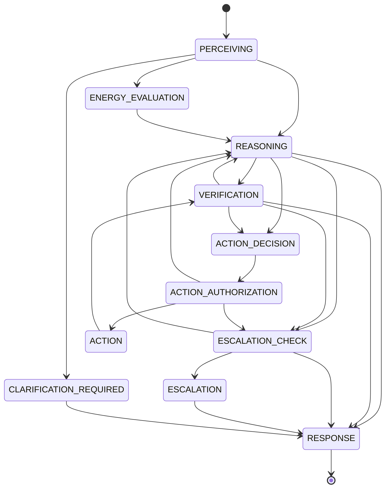

# The 13-State DOP Graph

DOP = **Decision-Oriented Pathway**. The DOP Engine (`edma_core.dop`) is the
SOLE transition authority: components and the model return **facts only** —
they never choose target states. The runtime (`edma_core.runtime`) is the only
caller of `dop.decide()`.

## States (frozen — exactly 13)

`START, PERCEIVING, ENERGY_EVALUATION, REASONING, VERIFICATION, ACTION_DECISION,
ACTION_AUTHORIZATION, ACTION, ESCALATION_CHECK, ESCALATION,
CLARIFICATION_REQUIRED, RESPONSE, END`

## Legal transitions (frozen, verbatim from `dop.py`)

| from | to |
|---|---|
| START | PERCEIVING |
| PERCEIVING | ENERGY_EVALUATION, REASONING, CLARIFICATION_REQUIRED |
| ENERGY_EVALUATION | REASONING |
| REASONING | VERIFICATION, ACTION_DECISION, ESCALATION_CHECK, RESPONSE |
| VERIFICATION | REASONING, ACTION_DECISION, ESCALATION_CHECK, RESPONSE |
| ACTION_DECISION | ACTION_AUTHORIZATION |
| ACTION_AUTHORIZATION | ACTION, ESCALATION_CHECK, REASONING |
| ACTION | VERIFICATION |
| ESCALATION_CHECK | ESCALATION, REASONING, RESPONSE |
| ESCALATION | RESPONSE |
| CLARIFICATION_REQUIRED | RESPONSE |
| RESPONSE | END |
| END | — (terminal) |

Any transition outside this table raises `TransitionError`. `decide()` returns
only states from `STATES`; terminal `END` has no outgoing edge (calling
`decide(END, …)` raises `PolicyError`).

## Policy invariants

- The policy is deterministic given `(current_state, facts)`. The model cannot
  inject decisions: model-emitted control fields (`authorized`, `verified`,
  `state`, `next_state`, `dop_next`, …) are scrubbed by the runtime into
  `Facts.ignored_model_fields` before facts reach the DOP engine.
- Waiting states (e.g. `ACTION_AUTHORIZATION` with `pending_human`,
  `CLARIFICATION_REQUIRED`) pause WITHOUT transitioning — resumption is an
  explicit caller action (`answer_run`).
- Exactly **6 cognitive components** exist (Perception, Energy, Reasoning,
  Action/Verification chain, Response); `ESCALATION` is control flow, not a
  component.
- Non-progress is detected **semantically first** (repeated identical
  reasoning/verification fingerprints → `ESCALATION_CHECK`); the hard step cap
  (`MAX_STEPS_HARD`) is only a secondary safety net.
